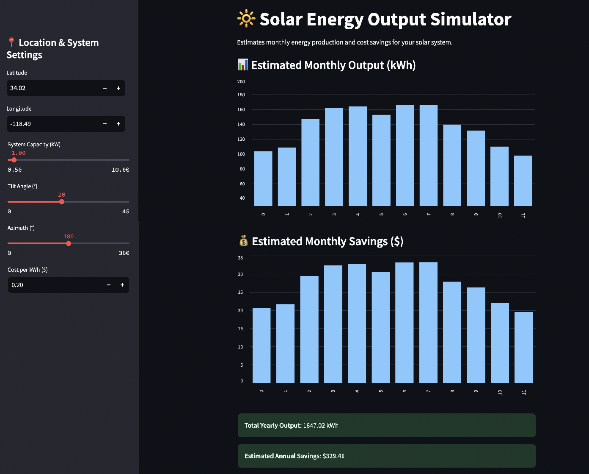

# 🔆 Solar Energy Simulator

A simple and interactive web app that simulates solar panel energy production and estimated cost savings based on location and system configuration. Built with Python and Streamlit using real data from the NREL PVWatts API.

---

## 🚀 Features

- 📍 Input any location (via latitude and longitude)
- ⚙️ Customize panel tilt, orientation (azimuth), and capacity (kW)
- 🔢 Get monthly energy output and yearly totals
- 💰 Estimate cost savings based on local energy prices
- 📊 Interactive charts with monthly data

---

## 🛠️ Tech Stack

- Python 🐍
- Streamlit for UI 🧰
- Requests for API calls 🌐
- Matplotlib/Streamlit Chart for visualization 📈
- NREL PVWatts API for real-world solar energy data ☀️

---

## 📸 Screenshots

### Main App View

